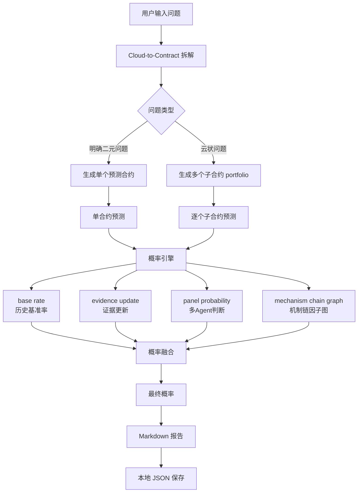

# 超预测思想驱动的 LLM 组织预测系统

基于 Tetlock 的超预测思想，开发一个大型 Agent 系统，其中 LLM 负责组织预测流程，概率系统负责计算。

## 环境准备

```bash
conda create -n forecasting_os python=3.12
conda activate forecasting_os
pip install -r requirements.txt
```

## 预测流程

